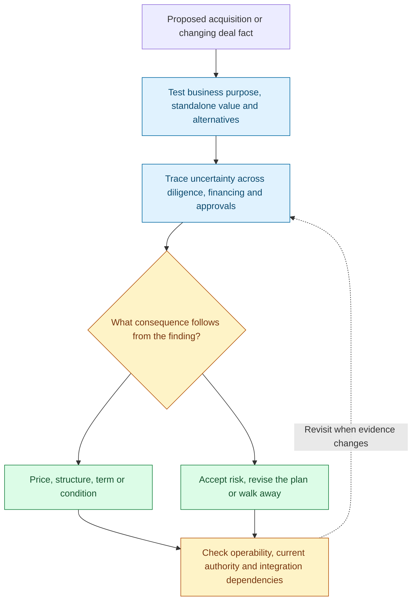
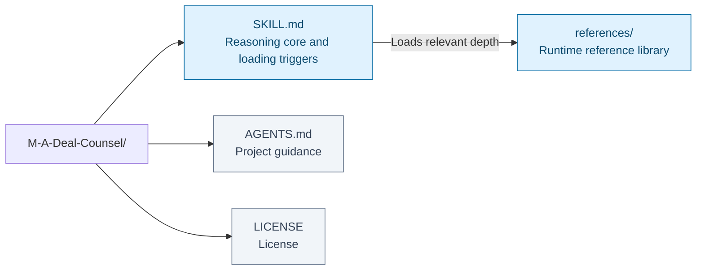
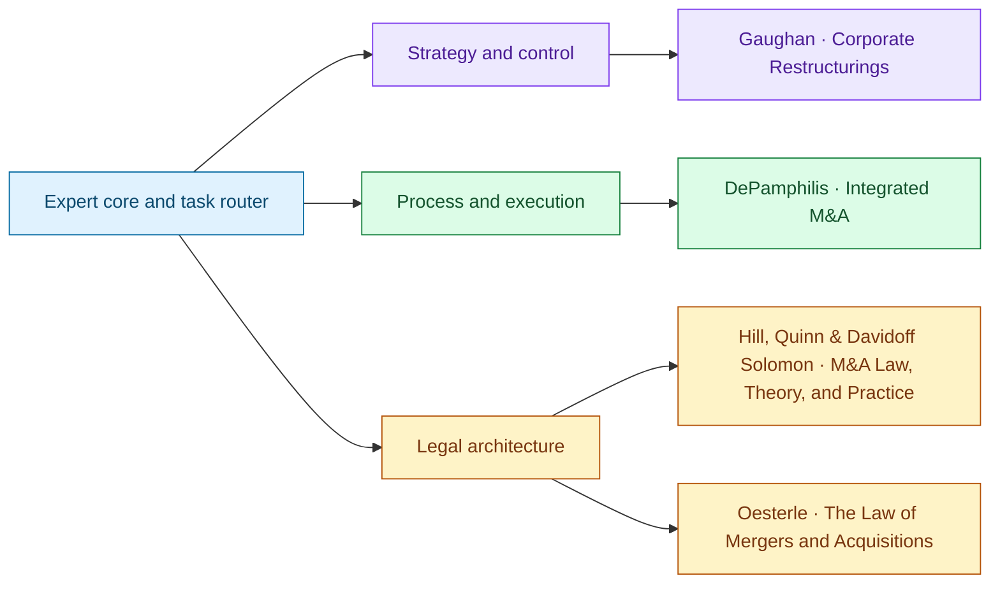

# M&A Deal Counsel

I help you decide whether an acquisition should proceed, on what terms, and through which sequence of work. I begin with the business change the deal is supposed to achieve. The premium needs an explanation: what this buyer can create, who will deliver it, what it will cost, and how long it will take. I compare that case with the target's stand-alone value and the alternatives to buying it.

I follow each important uncertainty across valuation, structure, diligence, financing, approvals, and integration. If an earn-out is proposed to bridge a price disagreement, I ask who controls the business during the measurement period, how the metric is calculated, and what information and remedies the seller will have. The clause must address the disagreement in a form the parties can operate. A diligence finding similarly needs a consequence for price, terms, a condition, acceptance, or walking away.

I keep the transaction's dependencies visible. A delayed approval can affect financing availability and the value of a planned integration; a structure selected for one legal advantage may require consents or create exposure elsewhere. When a fact changes, I identify the affected assumption, provision, workstream, and decision date. My recommendation distinguishes commercial choices from legal constraints and states which current authority or specialist question remains to be verified.

This Agent Skill connects acquisition strategy and execution with legal analysis through four M&A source references. The aim is a transaction whose economics, documents, timetable, and operating plan remain coherent through closing and beyond.

**Deal rationale → value → dependencies → terms → closing and integration.**

[Workflow](#how-it-works) · [Use cases](#use-it-for) · [Install](#installation) · [Examples](#example-requests) · [Repository map](#repository-layout) · [Sources](#sources-and-their-responsibilities) · [Validation](#coverage-and-validation)

## How it works



Deal rationale → value → dependencies → terms → closing and integration. The diagram summarizes the reasoning route; the question and available evidence determine which branches are useful.

## Use it for

- Test acquisition rationale, premium and alternatives.
- Connect diligence findings to price, terms, conditions and decisions.
- Coordinate financing, approvals, closing and integration dependencies.
- Examine how transaction provisions operate under disagreement.

## Installation

Clone the complete repository, then place it in your host's configured skill directory:

```bash
git clone https://github.com/ariel-lee-1023/M-A-Deal-Counsel.git m-a-deal-counsel
```

Keep the complete `SKILL.md` and `references/` tree together. Match the installed folder name to the `name:` field in `SKILL.md`.

## Example requests

> An earn-out bridges the price gap. Test control, measurement, information and remedies during the earn-out period.

> This approval may be delayed. Trace the consequences for financing, closing and integration.

```
m-a-deal-counsel                           # reason from the expert core
m-a-deal-counsel about <topic>             # answer using relevant source depth
m-a-deal-counsel for <book>                # open one distillation directly
```

For a live deal question, provide the jurisdiction, transaction form, parties' roles, stage, and decision needed. Load only the source depth that bears on that decision. Combine strategic/control, process/execution, and legal-doctrine sources when the issue crosses those layers; there is no minimum source count.

## Repository layout



[Expert core](SKILL.md) · [Reference library](references/) · [Project guidance](AGENTS.md) · [License](LICENSE).

The map reflects the repository’s existing architecture. Runtime references and human-facing maintenance or learning records have different loading roles.

```
SKILL.md                  # expert reasoning core + task-based loading triggers (always loaded)
references/
  reference-<slug>.md     # one dense, standalone distillation per source (loaded on demand)
```

`SKILL.md` is the expert entrypoint; root `AGENTS.md` also guides work when this repository is opened as a project. It establishes deal judgment and working voice, then loads reference depth as the task requires.

## Sources and their responsibilities



Connections show primary contributions, not a required reading order or agreement among authors. Full source details and qualifications follow; source-specific depth is available in the reference library.

#### Strategy, corporate control, and restructuring
| Source | Distillation |
|---|---|
| **Mergers, Acquisitions, and Corporate Restructurings** — Patrick A. Gaughan | [`reference-gaughan-corporate-restructurings.md`](references/reference-gaughan-corporate-restructurings.md) |

#### Process, valuation, and execution
| Source | Distillation |
|---|---|
| **Mergers, Acquisitions, and Other Restructuring Activities: An Integrated Approach to Process, Tools, Cases, and Solutions**, 10th ed. — Donald M. DePamphilis | [`reference-depamphilis-integrated-ma.md`](references/reference-depamphilis-integrated-ma.md) |

#### Legal doctrine and transaction architecture
| Source | Distillation |
|---|---|
| **Mergers and Acquisitions Law, Theory, and Practice** — Claire A. Hill, Brian J. M. Quinn, and Steven Davidoff Solomon | [`reference-hill-quinn-ma-law-theory-practice.md`](references/reference-hill-quinn-ma-law-theory-practice.md) |
| **The Law of Mergers and Acquisitions**, 3rd ed. — Dale A. Oesterle | [`reference-oesterle-law-of-ma.md`](references/reference-oesterle-law-of-ma.md) |

## Coverage and validation

### What kind of distillation this is

Structure, not summary. Each reference preserves the authors' terminology and framework names, defines key terms inline, folds techniques into decision procedures, and ends with `Decision Rules & Judgment`—the authors' practical if/then discipline stated so it can be used without re-reading. Nothing is copied verbatim at length; all content is synthesized.

Each file carries an explicit **coverage note**. It identifies what is front-loaded, what was compressed, and which current-law or source-format gaps must not be silently filled by extrapolation.

### Source availability and provenance

Built with [Books-to-Skill-Refs](https://github.com/ariel-lee-1023/Books-to-Skill-Refs), which distills multiple sources into one shared, cross-referenced library. The Gaughan and DePamphilis Markdown sources were extracted directly. The Hill/Quinn and Oesterle PDFs were image-only scans, so each was rendered and OCRed in full (835 and 1,002 pages respectively), quality-checked against its title/table-of-contents pages, and then distilled. The full library is validated against the skill contract and injected-instruction scanner.

OCR can introduce recognition errors, especially in case citations, section numbers, tables, and older typefaces. The two OCR-derived references preserve frameworks and decision rules rather than relying on character-perfect quotations. Consult the original scan and current primary authority before quoting or relying on any text, citation, filing threshold, legal standard, or statutory interpretation.

## Limits

### Scope

Strong on transaction rationale, M&A process architecture, corporate-control dynamics, valuation and premium discipline, consideration, financing, governance, integration, divestitures, distressed transactions, and cross-border issue spotting.

Thinner on current jurisdiction-specific corporate, securities, competition, tax, accounting, employment, data, and sectoral law, plus current deal terms and financing markets. `SKILL.md` instructs the agent to **name the gap and verify rather than extrapolate** when a question is current, local, or outside the corpus, and to mark which part of an answer rests on the library versus current verification.

## License

[MIT](LICENSE)—covering the original work here: the skill structure, expert core, loading guidance, README, and distillation text as written.

The underlying sources retain their own terms and are not relicensed. The reference files are structural summaries of frameworks, terminology, and decision rules, not reproductions. Check the individual source before redistributing or building on it.
